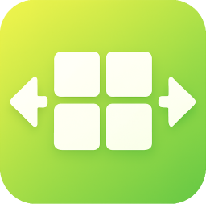

#  VdLabel

VdLabelは仮想デスクトップを便利に利用するためのアプリケーションです。

## インストール

[GitHubのリリースページ](https://github.com/Freeesia/VdLabel/releases/latest)からダウンロード

### インストーラー版 

`VdLabel-(バージョン).msi`をダウンロードして実行します。    
.NETがインストールされていない環境でも動作します。

### ポータブル版

`VdLabel-(バージョン).zip`または`VdLabel-full-(バージョン).zip`をダウンロードして任意のディレクトリに解凍し、`VdLabel.exe`を実行します。

* `VdLabel-(バージョン).zip`は.NETがインストールされている環境で動作します
* `VdLabel-full-(バージョン).zip`は.NETがインストールされていない環境でも動作します

## 特徴

### 仮想デスクトップのラベル表示

仮想デスクトップに名前や画像を設定して、切り替える際に見た目でわかりやすくします。

### ウィンドウの固定

アプリケーションの起動時に、自動的に指定した仮想デスクトップにウィンドウを移動します。これにより、特定の作業環境を素早く構成することができます。

### 自動起動

Windowsの起動時に自動的に起動するように設定できます。

### コマンド結果の表示

コマンドの実行結果をラベルに表示します。

例えば、`cmd /c "echo VdLabel && echo %time%"`を登録すると、以下のように時刻が表示されます。

### ショートカットキー

#### 現在の仮想デスクトップの表示

`Win + Ctrl + Up`キーで現在の仮想デスクトップのラベルを表示します。
> [!IMPORTANT]
> Windows 10 では`Win + Up`が優先されてしまうので、`Win + Alt + Up`に割り当てられます

#### 仮想デスクトップの切り替え

標準の`Win + Ctrl + (Left or Right)`キーで仮想デスクトップに切り替えに加えて、以下のショートカットキーで瞬時に特定の仮想デスクトップに切り替えることができます。

* `Win + Ctrl + テンキー(0-9)` キーで10個目までの仮想デスクトップに切り替えます。
* `Win + Ctrl + Alt + テンキー(0-9)` キーで11-20個目までの仮想デスクトップに切り替えます。

#### 一覧から切り替え

`Win + Ctrl + Down`で仮想デスクトップ一覧を表示して、方向キーで仮想デスクトップを切り替えることができます。
`Enter`か`Esc`で一覧を閉じます。
> [!IMPORTANT]
> Windows 10 では`Win + Down`が優先されてしまうので、`Win + Alt + Down`に割り当てられます

## 設定

タスクトレイのアイコンをクリックして、設定を開きます。

