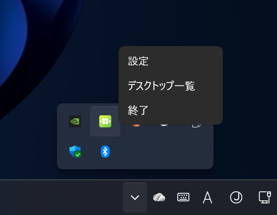

#  VdLabel

VdLabelは仮想デスクトップを便利に利用するためのアプリケーションです。

## ダウンロード

[GitHubのリリースページ](https://github.com/Freeesia/VdLabel/releases/latest)からzipをダウンロードして任意のフォルダに展開します

* `WindowTranslator-(バージョン).zip`は.NETがインストールされている環境で動作します
* `WindowTranslator-full-(バージョン).zip`は.NETがインストールされていない環境でも動作します

## 特徴

### 仮想デスクトップのラベル表示

仮想デスクトップに名前や画像を設定して、切り替える際に見た目でわかりやすくします。

### ウィンドウの固定

アプリケーションの起動時に、自動的に指定した仮想デスクトップにウィンドウを移動します。これにより、特定の作業環境を素早く構成することができます。

### 自動起動

Windowsの起動時に自動的に起動するように設定できます。

### コマンド結果の表示

コマンドの実行結果をラベルに表示します。

例えば、`cmd /c "echo VdLabel && echo %time%"`を登録すると、以下のように時刻が表示されます。

### ショートカットキー

#### 現在の仮想デスクトップの表示

`Win + Ctrl + Up`キーで現在の仮想デスクトップのラベルを表示します。

#### 仮想デスクトップの切り替え

標準の`Win + Ctrl + (Left or Right)`キーで仮想デスクトップに切り替えに加えて、以下のショートカットキーで瞬時に特定の仮想デスクトップに切り替えることができます。

* `Win + Ctrl + テンキー(0-9)` キーで10個目までの仮想デスクトップに切り替えます。
* `Win + Ctrl + Alt + テンキー(0-9)` キーで11-20個目までの仮想デスクトップに切り替えます。

## 設定

タスクトレイのアイコンをクリックして、設定を開きます。

